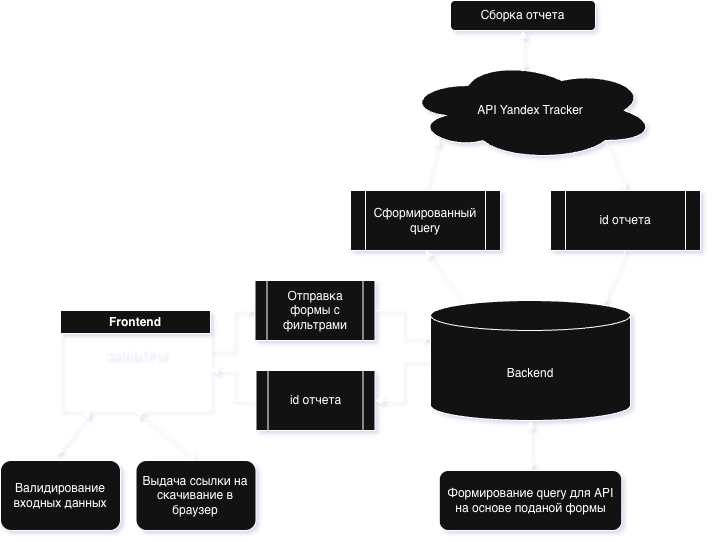

<p align="center"><a href="https://laravel.com" target="_blank"></a></p>
<p align="center"><a href="https://vuejs.org" target="_blank" rel="noopener noreferrer"></a></p>

# Выгрузка задач из Yandex Tracker (via API)

Сарыглар Начын

## Инструкция по развертке и тестированию:
 
 - Убедитесь в браузере, что вы вошли в нужную организацию в Яндекс Трекере
 - Клонируйте репу и из `a25-yandex-tracker` запустите след команды:
```shell
docker-compose up -d --build
docker exec -it laravel_app bash
cp .env.example .env
php artisan key:generate
php artisan migrate
exit
```
 - Настройте .env файл, а именно поля: `YANDEX_TRACKER_OAUTH_TOKEN` и `YANDEX_TRACKER_X_CLOUD_ORG_ID`

    Форма выгрузки будет доступна по адресу `localhost:5173`
 
 - Открыв форму, введите необходимые фильтры для выгружаемых задач и нажмите кнопку `Выгрузить в excel` 
 - Через некоторое время, страница сама начнет загрузку excel файла. Если этого не произошло, то нажмите "Скачать Excel".

## Общая реализация
Фронт посылает запрос с фильтрами задач на бэк для получения <u>id отчета</u>, который формируется на стороне яндекса. Затем с этим id создается ссылка по типу `https://tracker.yandex.ru/ajax/v2/metaEntities/reports/<id_отчета>/attachments` который в последвии отправляется на браузер пользователя для скачивания.


